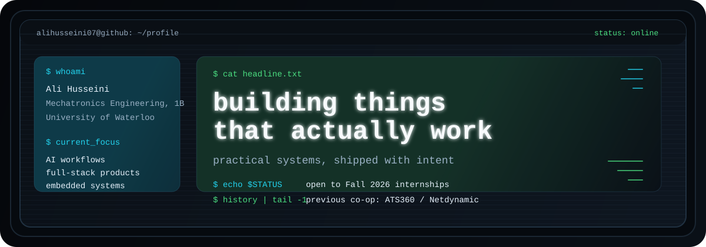

<p align="center">
  
</p>

```bash
$ ./connect --links
portfolio  -> https://alihusseini.vercel.app/
linkedin   -> https://www.linkedin.com/in/ahusseini-profile
email      -> a35husse@uwaterloo.ca
```

```bash
$ cat profile.txt
Ali Husseini
1B Mechatronics Engineering @ University of Waterloo
Ontario, Canada

I like building practical systems that solve real problems cleanly,
especially across AI workflows, full-stack products, and embedded software.
```

```bash
$ ls stack/
languages/  frameworks-libraries/  tools/
```

```txt
stack/languages/
|-- Python
|-- TypeScript
|-- JavaScript
|-- C++
|-- Java
|-- SQL
|-- HTML
|-- CSS
|-- Bash
`-- Swift
```

```txt
stack/frameworks-libraries/
|-- React
|-- SuiteScript
|-- SwiftUI
|-- Next.js
|-- Tailwind CSS
|-- Node.js
|-- NumPy
|-- Pandas
|-- Prisma
|-- pytest
|-- Express
|-- Fastify
`-- Playwright
```

```txt
stack/tools/
|-- Git
|-- GitHub
|-- Docker
|-- PostgreSQL
|-- Supabase
|-- Neon
|-- Railway
|-- NetSuite
|-- SuiteCloud
|-- Notion
|-- Excel
|-- AWS S3
|-- AWS Lambda
`-- AWS Bedrock
```

```bash
$ tree featured_builds/ -L 1
featured_builds/
|-- ChefIt/
|-- Clarus/
|-- WaterlooWorks+/
`-- ATS360-Netdynamic/
```

```txt
featured_builds/ChefIt/
stack: SwiftUI, Node.js, Express, PostgreSQL, OpenAI Vision
summary:
  Social cooking platform with pantry scanning, recipe matching,
  social posting, reviews, and smart shopping flows.
```

```txt
featured_builds/Clarus/
stack: TypeScript, Next.js, React, Fastify, Prisma, PostgreSQL, Playwright
summary:
  Student dashboard that syncs D2L course data and uses an LLM-powered
  planning layer to rank deadlines and guide daily academic work.
```

```txt
featured_builds/WaterlooWorks+/
stack: JavaScript, Node.js, PDF.js
summary:
  Chrome extension for co-op job discovery that parses resumes,
  scores fit, highlights gaps, and reorders postings by compatibility.
```

```txt
featured_builds/ATS360-Netdynamic/
stack: SuiteScript, AWS Lambda, S3, Transcribe, Bedrock
summary:
  Built AI video screening, scheduling workflows, and resume scoring QA
  for 30+ enterprise hiring teams in production.
```

```bash
$ cat current_status.log
[OPEN]    Fall 2026 internships
[PREV]    Software Engineer Co-op @ ATS360 / Netdynamic
[FOCUS]   Applied AI with operational value
[BUILD]   Products that are useful, fast, and well-structured
```
