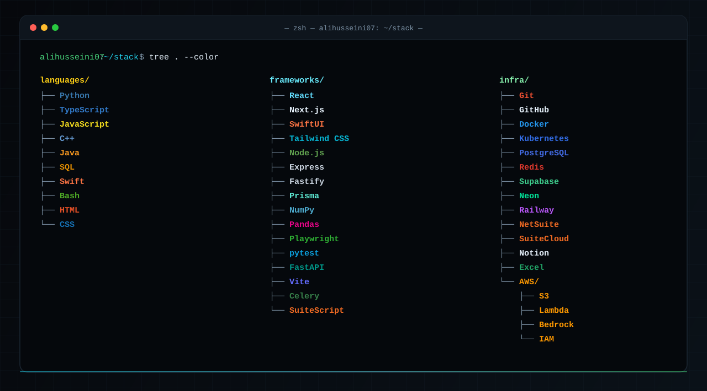
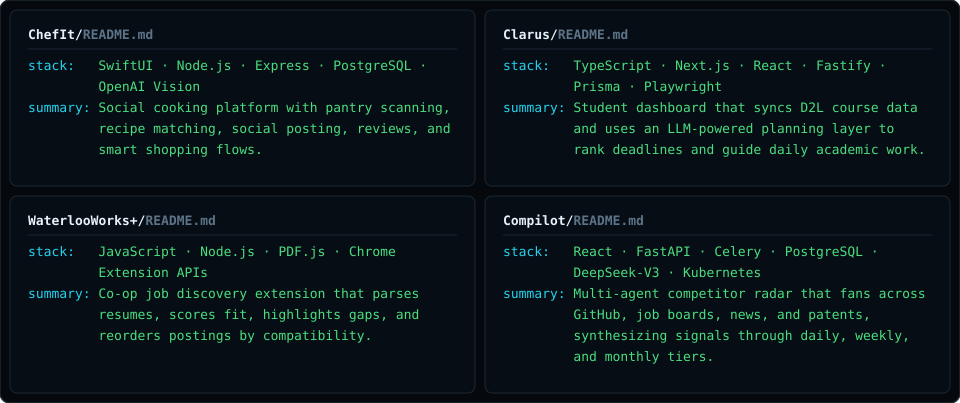

<p align="center">
  
</p>

<pre>
<b>$ ./connect --links</b>
─────────────────────────────────────────────────────────────
  portfolio   →  <a href="https://alihusseini.ca/">alihusseini.ca</a>
  linkedin    →  <a href="https://www.linkedin.com/in/ahusseini-profile">linkedin.com/in/ahusseini-profile</a>
  devpost     →  <a href="https://devpost.com/ahusseini007">devpost.com/ahusseini007</a>
  email       →  <a href="mailto:ahusseini007@gmail.com">ahusseini007@gmail.com</a>
─────────────────────────────────────────────────────────────
</pre>

```bash
$ cat ~/profile/about.md
# Ali Husseini
> 1B Mechatronics Engineering · University of Waterloo · Ontario, CA

I build practical systems that solve real problems cleanly —
across applied AI, full-stack products, and embedded software.

I care about the user first. Every system I ship aims to feel
fast, obvious, and friendly to the person actually using it —
the kind of tool you don't have to think about, you just use.

I also care about: shipped over polished, fast over clever,
and code that someone else can read six months later.
```

<p align="center">
  
</p>

<pre>
<b>$ ls -la ~/featured_builds</b>
total 4
drwxr-xr-x  <a href="https://github.com/MatthewKim07/chef-it">ChefIt/</a>                # social cooking, computer-vision pantry
drwxr-xr-x  <a href="https://github.com/athravseruwam07/clarus">Clarus/</a>                # LLM-planned student dashboard, D2L sync
drwxr-xr-x  <a href="https://github.com/MatthewKim07/waterloo-works-plus">WaterlooWorks+/</a>        # co-op job ranker, Chrome extension
drwxr-xr-x  ATS360-Netdynamic/     # AI hiring tools, prod @ 30+ teams
</pre>



<pre>
<b>$ git log --oneline --graph --since="30 days ago"</b>
</pre>


