<p align="center">
  
</p>

<p align="center">
  
</p>

<p align="center">
  <a href="https://alihusseini.vercel.app/"></a>
  <a href="https://www.linkedin.com/in/ahusseini-profile"></a>
  <a href="mailto:a35husse@uwaterloo.ca"></a>
  <a href="https://github.com/alihusseini07"></a>
</p>

<p align="center">
  <strong>University of Waterloo Mechatronics Engineering, 1B</strong><br/>
  I build across software, AI, and hardware, with a bias toward products that solve messy real-world problems cleanly.
</p>

---

## `about.exe`

```txt
name        : Ali Husseini
location    : Ontario, Canada
focus       : applied AI, full-stack systems, workflow tooling, embedded software
mindset     : iterate fast, keep it practical, ship with intent
experience  : Software Engineer Co-op @ ATS360 / Netdynamic Inc.
```

## `stack/`

<p align="center">
  
</p>

<p align="center">
  
  
  
  
  
  
  
  
  
  
  
  
  
  
  
  
  
  
  
</p>

## `featured_projects/`

<table>
  <tr>
    <td width="50%" valign="top">
      <h3>ChefIt</h3>
      <p>Social cooking platform built with <strong>SwiftUI, Node.js, Express, PostgreSQL, and OpenAI Vision</strong>. Pantry scanning, recipe matching, social posting, reviews, and smart shopping flows in one product.</p>
      <p>
        
        
        
        
      </p>
    </td>
    <td width="50%" valign="top">
      <h3>Clarus</h3>
      <p>Full-stack academic dashboard using <strong>TypeScript, Next.js, React, Fastify, Prisma, PostgreSQL, Playwright, and Docker</strong> to sync course data from D2L and turn it into LLM-powered study planning.</p>
      <p>
        
        
        
        
      </p>
    </td>
  </tr>
  <tr>
    <td width="50%" valign="top">
      <h3>WaterlooWorks+</h3>
      <p>Chrome extension built with <strong>JavaScript, Node.js, and PDF.js</strong> to parse resumes, analyze job descriptions, surface skill gaps, and re-rank co-op listings based on fit.</p>
      <p>
        
        
        
      </p>
    </td>
    <td width="50%" valign="top">
      <h3>ATS360 / Netdynamic Co-op</h3>
      <p>Built and shipped production hiring workflows with <strong>SuiteScript, AWS Lambda, S3, Transcribe, and Bedrock</strong>, including AI video screening, scheduling flows, and scoring QA across 100+ resumes.</p>
      <p>
        
        
        
        
      </p>
    </td>
  </tr>
</table>

## `current_signal`

```txt
> building products at the intersection of ai + automation + real workflows
> interested in startup environments, full-stack engineering, and embedded systems
> always looking for hard problems worth simplifying
```
